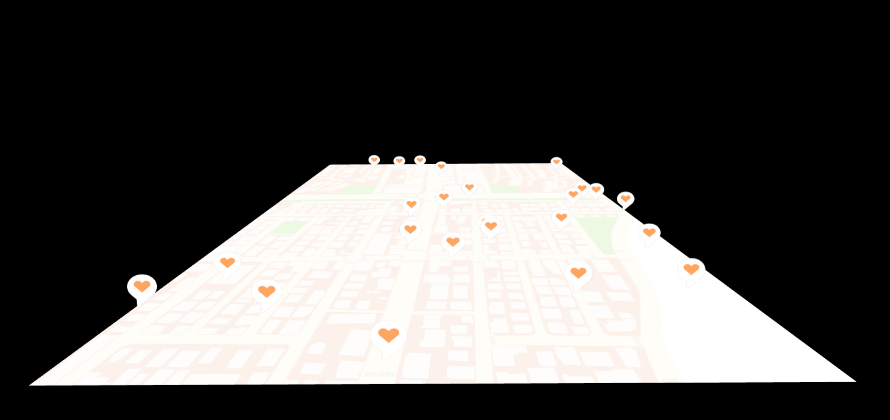

# dabeeo-three-map

## Dabeeo F/E Developer coding test 2type

**page: https://minji-baek.github.io/dabeeo-three-map/** 

### 1. 3D 공간에 지도이미지 plane에 texture로 설정 후 배치

### 2. 마우스 드래그로 이동/회전, 스크롤로 확대/축소
- OrbitControls 사용.
- 기존 OrbitControls은 좌클릭 => 회전, 우클릭 => 이동 이 default라 서로 설정 바꿈.
- 스크롤은 그대로 확대/축소로 설정

### 3. 지도 load시 랜덤한 숫자의 marker가 지도 위에 배치
- THREE.MathUtils 안에 랜덤 함수 사용
- marker는 Points 사용하여 buffer에 랜덤한 Position 값을 넣어 위치를 랜덤 설정

### 4. 브라우저 새로 고침 시 마커 랜덤 배치
- load 시 마다 새로 생성 및 배치

#### git code clone 시
- npm install
- npm run dev

 
